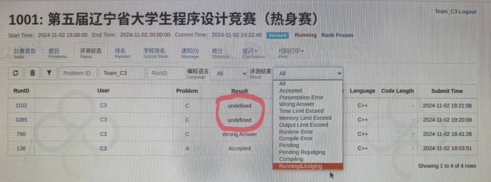
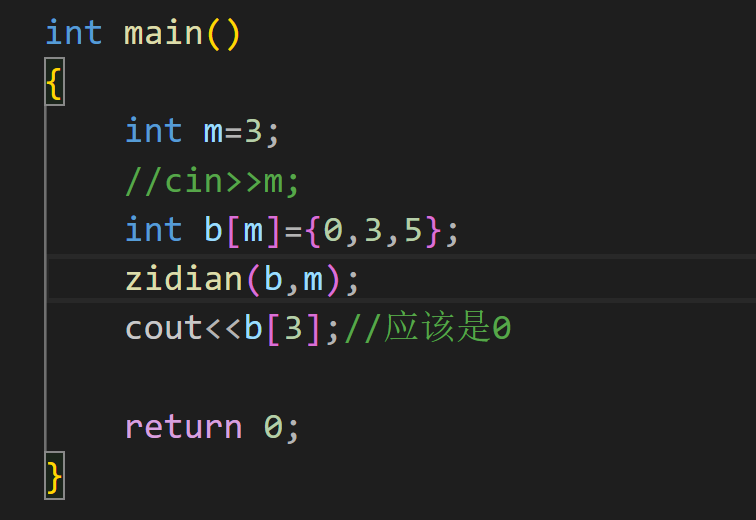

---
hide:
  - navigation
---
# ***Debug Secret Script***

## 提示：
在笔记内部使用了部分C++的内容，和语法

在此声明：

cout<<" " 可以看成C语言中的printf

cin>>"  "可以看成C语言中的scanf

string部分采用的是C++，C语言字符串部分由于不常用，所以在内容中尚未体现

## 引言：

Debug也是一种能力的体现，在算法学习的过程中，不光要学习各种算法知识（c++，stl，数据结构等），还要学会调试代码。
每一个人遇到的bug是不相同的，但我的目的是希望能给初学者在debug的过程中提供一些方向，我所写下的内容不多，希望能给你们带来一些帮助。

## 前提：

要稳住心态。

谨慎思考，减少罚时。

切忌自大，要仔细检查代码。

灵活使用IDE。

<span style="color: red">明白题意。</span>

团队赛，要和队友沟通，拓展思路。

## 比赛意见：

1.标识符命名需规范（简洁的前提是，你能记住每个标识符所代表的含义）

2.电脑死机时，或主动关机的情况下，不要随意乱动，请及时联系工作人员。

3.如果在正式开始的时候，发现无法进入系统，或者系统未安装，请及时联系工作人员。

4.发放账户密码的纸张，请自己盖好，防止其他队伍登录，帮你增加罚时

5.注意观察榜单，挑简单的先做。

<span style="color: red">6.注意！！！不要在比赛时间尚未开始时翻看试卷。</span>

7.不要有心理压力，放平心态。

8.减少犯罪次数（在提交显示错误之后，请认真修改）   

9.不要按Ctrl+Alt+F10,这会使电脑死机。

10.注意保存自己的代码。

11.出现问题，不要求助身边选手，人心叵测。

12.请选择靠谱的队友，能坚持下去和你比赛的。   

13.如果遇到提交结果为undefined（测题机坏了），请暂停提交，如果继续提交，很有可能一堆wa下去。

<span style="color: red">14.禁止作弊！！！</span>



## 个人感悟：

放平心态，这也是我在经历数次的折磨之后，明白的一件事情，专心调试就好，其他人做完不做完又有什么可在意的呢？（虽然有位学长总是在强调“犯罪”的问题，但这只是为了让你重视和珍惜每一次提交的机会，不要有太多压力，就算爆零又如何？）尽力就好，享受过程，debug是痛苦的，但是在这漫长而又枯燥的过程中，我们理应学会苦中作乐。

## 一.基础bug

基础bug---IDE能直接识别出的bug。

识别基础bug的最好方式是---打开 <span style="color: red">IDE</span>

解决方式：阅读IDE反馈的信息

### 常见的基础bug:
`{}`问题：很多时候，由于自己的复制剪贴，可能会使得 `}` 漏掉，这个时候点击测验的时候，可能会显示`error}`，
因而在写代码的过程中，要注意是否忘记 `}` 符号。
```c++
scanf("%d",&a); //常见的错误就是忘记输入了&（取地址符）

scanf("% ",&);  //%后面的格式转换码与数据类型没有对应   易错点：double 对应%lf

自定义函数时，忘记return;
```

标识符先前已经定义过：
```c++
int a;
int b;
int b=1024;(报错)	//不能连续定义同一个变量的数据类型，如果要进行修改可以选择（float）b;或者直接删除此语句
//进行强制修改其类型。
```

同一变量名称反复定义的方法：

```c++
for(int a=0;a<5;a++){
	
}
for(int a=0;a<5;a++){
        
}
//在for()内部进行定义
```

由于变量a是在for循环内部定义的，因此可以重复定义。（有一定风险就是，你得确保这个变量不需要保存数据什么的，因为在外界使用的话，会显示该变量不存在）

### ！！！.函数传数组：


***正确传递数组的方式为：***




## 二.反馈：
在debug的过程中，反馈尤为重要

反馈分为两种：
第一种为IDE所给你的反馈
第二种为自行反馈

自行反馈意味着，你需要自己寻找到错误在哪
常见的做法是，在每一个模块的内部，放置一条测试语句 

```c++
例如：printf("123");
```

 看看该语句是否在判断语句的内部中实现。(自行找到反馈，计算机不能告诉到底是哪个环节输入错误，但是你可以自己验证并得到反馈)
 例如：
 ```c++
 if(条件){
	printf("123");
 }
 ```
检查数组正确输入：
```c++
cout<<a[1];
```
大部分IDE和做题系统，反馈都是英文的，不要求把单词都认的出来，找到关键信息（真正的错误提示）即可；

## 三.检测时的几种错误：

<b style="color: red">检测时，要注意输入的是案例几，不要对着案例一进行检测，然后对着案例二的答案进行修改</b>

### 1.编译错误：


最容易修改的错误，一般根据反馈，找出关键信息，即刻修改。

例如此案例，能清楚的看见计算机将错误的语句反馈给我们，

当然，如果看不懂计算机告诉你的信息，建议一点点的开始看，从找关键符号，和使用翻译软件等方式解决。

### 2.运行超时：


基本上就是for等循环出现了问题，一般要关注的点有，循环条件，循环变量是否在函数内部进行改变，以至于陷入死循环。

for循环内部无范围限制

```c++
例如：for(int i=1;i<5;)	//缺少了i++(变量未改变)
```

<span style="color: red">ps : while循环比较特殊，它可以存入特殊循环条件</span>

又或者是for循环中出现

```
for(int i=0;i<n;j++) //循环变量名称错误！！！
```

若是使用while循环

```
请检查：
while(是否是死循环？)
while（是否判断结束循环的条件中，变量的范围是否没考虑）
```

### 3.无法在规定时间内运行：

由于时间复杂度过高，导致超时。

解决方法：

通过if等其他手段，减少循环的使用。

可以去学习一些优化操作，如剪枝等；

选择更换做题思路，可能是自己将简单问题复杂化了，算法题的思路有很多种，如果可以，请不要将自己的思维固化。

ps:有些题是无法单纯通过暴力枚举解决的，一味的暴力枚举，换来的代价就是极高的时间复杂度。

在算法的学习中，需要去学会计算时间复杂度

pps:使用#define endl '\n';

endl运行消耗的时间大于\n，为了书写习惯，此定义将完美避开这个问题

### 4.段错误：


段错误:程序发生段错误，可能是数组越界，堆栈溢出（比如，递归调用层数太多）等情况引起。

一般情况，需要检查的是数组是否开的过多，导致数组越界（数组越界，是因为连续开两个数组，在内存中的排布其实是相连的）

解决方式：如果自己定义的数组过多，可以考虑删除一个数组。

检查自己的数组容量是否开的过大（一般范围是在1e8左右）

下标是否正确？一般是在循环中查看是否循环内容出了问题

<span style="color: red">函数递归调用过多，检查函数是否内部语句是否正确</span>

ps:检查到底是哪个环节出现问题，通过将部分语句变成注释`//`，看看是否仍然发生段错误，如果到了最开始时，仍出现段错误，那么只有一种结果就是数组开的过于庞大。

！！！在一些题中，不要根据题目中出现数组，就一味的去使用数组，当出现数组越界的时候，最好是转换思路，同时减少或者避免数组的使用

！！！在做题中，请减少二维数组的使用

### 5.输入格式不符：

审题不够严谨造成的原因，去检查最后输出格式是否遗漏"  "(空格)

或者输出内容是否包含 \ , '等符号

注意保留几位小数点

如果是四舍五入的问题，注意使用round函数（四舍五入到整数）。使用方式：通过*保留位数的10次幂，再将其除掉。

### 6.正确率为**%：


如果正确率在50%附近徘徊，说明此题可能分奇数和偶数，随后将输入示例，看看是否和奇数和偶数有关系。

如果正确率较低，那么基本上，切换示例就能够看出来问题出现在哪。(可能是数据范围小了)

多切换案例，想一些极端的例子

又或者由于超时，导致过大的案例未通过（观察运行时间）

## 四.输入格式与预期不符合：


如此题所示，在使用C++输入时候，如果将一串数据分单个数字存入其中，cin无法实现，请选择使用C语言中的scanf("%1d",a);

%1d意味着，每次只存入一个数。

<span style="color: red">所以在做题的过程中，需要注意示例的输入格式。</span>

ps:虽然C++在输入输出等层面变得更加便利和迅速，但是C语言的某些功能，仍然是必不可少的，因此，在拓展C++语言的时候，也不要忘记巩固C语言的使用。

！！！同时，观察运行时间是否超时，这种时候一般为超时，以至于有些案例无法正常通过，需要改变解题思路。

## 五.输入结果为空：

对于debug过程中，最怕的就是没有收获任何的反馈，因此在面临输入结果为空的时候，优先去查看自己的输出语句。

```c++
例如：for(  ; ; ){
			cout<<"123";//去检查for循环是否出现问题。
			}
	for( ; ; ){
		c++;
	}
	cout<<c<<endl;	//如果C的输出为空，寻找C变量上一次出现的位置是在什么位置，随后检查相应的语句。
```

除此之外，还有各种判断语句，都可能影响最后输出为空的情况。

如果是for循环和if的嵌套情况之下，可以通过

```c++
cout<<"语句"<<endl;
```

判断是哪个环节出现错误。

同时，在定义变量的情况之下，有的时候需要将变量进行初始化=0


例如这道题：去除前导0，不只是出现0408这种情况，还有可能会出现00408，因此在debug的过程中，通过判断数组的第一位是否为0是远远不够的，而如果只判断数组是否为0，然后为0不输出0，也是不可取的，因为这样的话，只会留下48。（只判断是否为0，并不是删除前导0，是删除数组中所有的0）

```c++
for(int p=0;p<c;p++){
    if(b[p]>0){
        for(;p<c;p++)
       cout<<b[p];//位置正确
    //for(int i=p;i<c;i++)
    //cout<<b[i];   
        break;
    }
}
return 0;
}
```


错误代码如下：

```c++
for(int p=0;p<c;p++){
    if(b[p]>0){
    for(int i=p;i<c;i++)
    cout<<b[i];   
    }
    break;
}
return 0;
}
```
错误原因：意外使用break;同时break是在for循环中放置，并非是放置在if中，因此造成了输出结果为空。

<span style="color: green">不难发现，有些时候，都是一些很简单的bug阻止结果的的正确</span>
<span style="color: red">不过不要因此变得消沉，请相信自己，下一次，绝对不会犯相同的错误。正视自己的失败，才能慢慢变得更加强大</span>

## 六.书写代码的一些小建议：

### 1.定义变量：

在定义整型变量的时候，尽量使用long long 而非int，这样可以不用判断数据是否超过Int型。

同理，在定义浮点型的时候，选择使用double，精确度更高，确保小数点的后几位都是正确的。

如果觉得long long在输入过于繁琐，可以选择在开头

```c++
#include <bits/stdc++.h>
using namespace std;
typedef long long ll;
int main(void)
{
	ll a;//直接输入ll.就代表着long long
}
```

同时，定义变量名称的时候，尽量避免使用o作为变量名称（因为o可能会和零混用

）

### 2.观感：

尽量让自己代码的长度缩减一点

使用三项表达式：

```c++
表达式1？表达式2：表达式3
```


格式改变：

```c++
例如：
	for(int i=0;i<n;i++){		//将'{'移动到和for同一行的位置来
		cout<<"110";
	}
如果是另一种形式：
	for(int i=0;i<n;i++)
	{
		cout<<"110";
	}
```

可以看出，优化后的代码减少了一行，这样看可能不太直观，那如果很多个for循环叠加的话？

```c++
	for(int i=0;i<n;i++){
	 for(int p=0;p<m;p++){
	 cout<<"110";
	 }
	}
如若不然：
	for(int i=0;i<n;i++)
	{
	 for(int p=0;p<m;p++)
	 {
	 cout<<"110";
	 }
	}
```

仅仅只是两个for循环的嵌套，就能看的出来，将 ' { ' 推进一行，所带来的观感就变得大不相同。

当然，可以稍微紧凑一点，因为过长的代码容易分辨不清各个语句的分布，但是请不要将代码堆砌成密不透风的城墙，同样也会影响读代码时候的速度。

### 3.输入：

输入数组时，要注意变量名称和变量位置是否正确:

例如： y[i]-x[i]，不要写成y[i]-y[i]

<b style="color: red">做题时，如果要分离每一位数，可以选择定义一个字符串，将每一位数都存入，能大大减小做题难度。</b>

## 七.删改代码：

删改代码的时候，不要进行遗漏，或者误删，在进行删除之后要<span style="color: red">重新进行检查</span>。

必要的时候通过使用注释来表明点。


## 八.多组数据：

在有些题目的样例中，并没有举出多组输入，这往往会被人所忽略，在做题前请认真读题。

```
int t;//几组数据
while(t--){

}//最外层使用while可以有效的将单组数据的内部循环分清
```

1.如果要识别换行符：输入

```
cin.get()='\n'
```

2.循环输入到结束：

```
whlie(cin>>n)
```


## 九.字符串问题：


在输入数字字符串的时候；

虽然输入的是数字，但是存入的确实字符，因此，如果要将数字输出，需要减去字符‘0’

```
例如：b[i]-'0';
```

在字符串题中，我一般使用C++中的string来写

### string函数定义：string a;

输入（包括空格的输入）getline(cin,a);

知晓字符串的尺寸 ：a.size()

开循环单个输出字符串:
for(int i=0;i<a.size();i++)
{
	cout<<a[i];
}
字符串长度length()
*******非必要，别tm开那么多的数组，无论是字符串数组，还是正常数组
*******数组越界，纯自找的，少给自己整点麻烦事！！！！！！！

c++中的size()和length()没有区别
都能算出字符长度


string str：生成空字符串

string s(str)：生成字符串为str的复制品

string s(str, strbegin,strlen)：将字符串str中从下标strbegin开始、长度为strlen的部分作为字符串初值

string s(cstr, char_len)：以C_string类型cstr的前char_len个字符串作为字符串s的初值

string s(num ,c)：生成num个c字符的字符串

string s(str, stridx)：将字符串str中从下标stridx开始到字符串结束的位置作为字符串初值

eg:


```c++
string str1;               //生成空字符串
string str2("123456789");  //生成"1234456789"的复制品
string str3("12345", 0, 3);//结果为"123"
string str4("012345", 5);  //结果为"01234"
string str5(5, '1');       //结果为"11111"
string str6(str2, 2);      //结果为"3456789"
```


1. size()和length()：返回string对象的字符个数，他们执行效果相同。
2. max_size()：返回string对象最多包含的字符数，超出会抛出length_error异常
3. capacity()：重新分配内存之前，string对象能包含的最大字符数

***\*string的交换：
\****void swap(string &s2);  //交换当前字符串与s2的值


string的插入：push_back() 和 insert()
void  test4()
{
    string s1;

```c++
// 尾插一个字符
s1.push_back('a');
s1.push_back('b');
s1.push_back('c');
cout<<"s1:"<<s1<<endl; // s1:abc

// insert(pos,char):在制定的位置pos前插入字符char
s1.insert(s1.begin(),'1');
cout<<"s1:"<<s1<<endl; // s1:1abc
```

}

#### **C++删除string最后一个字符的几种方法**

#include<iostream>
#include<string>
using namespace std;
int main() 
{
	string str;
	str = "123456";
	cout << str << endl;

```c++
//方法一：使用substr()
str = str.substr(0, str.length() - 1);
cout << str << endl;
 
//方法二：使用erase()
str.erase(str.end() - 1);
cout << str << endl;
 
//方法三：使用pop_back()
str.pop_back();
cout << str << endl;
return 0;
```

}

## 十.注意使用函数之后，变量转换的类型：

pow( )

sqrt( )

需要在函数前面进行强制性转换（long long）

同时pow( )中，无法使用1/3（不是整除的数）

同时由于整型的存储是有范围的

在计算时，请保持先除（/）后乘（*）的习惯


## *结尾：*

不难发现，有一些部分的案例很少，由于我自身并不喜欢算法，因而有过一个月的时间不去添加笔记上面的内容了。5000字已经是我现在能写的极限了，再加上算法题未来会很少做，所以我打算就此完结。后续的添加、修改和补充，就留给后面的学弟学妹们吧！

写这个笔记的想法，来自于软件2201的杜金雨，特此也感谢他的C语言速通笔记，在我初学C语言的时候，给了我很大的帮助。

虽然笔记名称叫做Debug Secret Script但是，我在里面写的不止是这些，可能有点脱离主题，但是为避免再开一个笔记单独讲这些，还是选择将这一切归纳到一起。从我个人角度来看，这一切是值得的，总归是留下了点什么东西。

面对排名的不如意，我曾多次陷入迷茫，感到失落。在debug过程中，也因为4、5个小时，甚至一天，让自己崩溃。为了防止有人再次陷入相同的问题，再次面临崩溃，希望这个笔记能帮助到你。

如果遇到一名叫葛日波的老师教你C语言，不管你那时C语言是否学完，请认真听讲，会使你受益匪浅。


对UIT的每日签题，我有以下几点要求要讲：

1.切忌上网抄袭，类似题解等东西，其实也不建议看（除非超过四个小时以上未能解开）

2.切忌注重签题排名，每日签题的目的是为了锻炼你的能力

3.不要抄身边人的代码，会有人负责查重

4.不准使用AI辅助做题，在学习阶段，重要的是锻炼你的编码能力

5.IOI赛制，禁止单次提交超过30次


                                                   不爱算法、不弱算法

																				   			------数技2401沐沐
