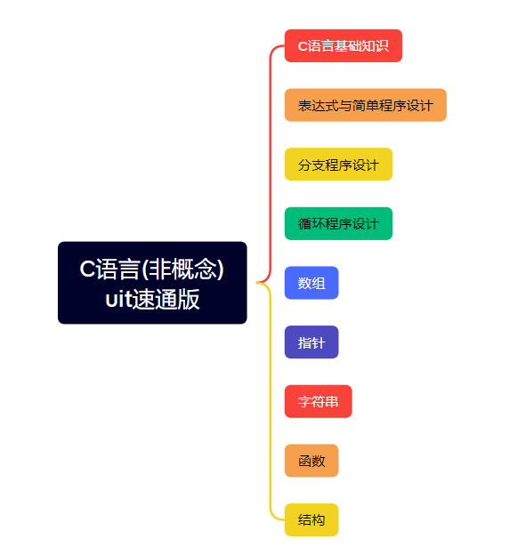

> 世界是你们的，也是我们的， 
> 但是归根结底是你们的。 
> 你们青年人朝气蓬勃， 
> 正在兴旺时期， 
> 好像早晨八九点钟的太阳。 
> 希望寄托在你们身上。—— 毛泽东

------

作为22级、23级 UIT 成员，我们见证了我们这几届 UIT 的起伏跌宕，一些琐事也阻挡着我们的前进，但总会有办法解决的，这也是uit的精神之一。

在我们了解了 UIT 鼎盛时期至新校区的落寞时期的历史时，我们也感叹为什么没有见识到哪些技术超群的学长学姐们，而他们留下来的资料，也全部随着校区的搬迁而遗失。

UIT 自始至终都是由学生发起的学生组织，由"我们"种树，留给"你们"乘凉，而你们终将会成为我们。

我们能留下和写下的不多，精力有限，而且写的较为浅显，但是对于入门来说足够了。

## 大纲

## 参考资料

* 【C语言程序设计 浙江大学：翁恺-哔哩哔哩】 [https://b23.tv/zIBWlNh](https://b23.tv/zIBWlNh)
* 学校教材配套文字/语音课程：[https://mooc1.chaoxing.com/course/206516700.html?clazzId=61785701](https://mooc1.chaoxing.com/course/206516700.html?clazzId=61785701)